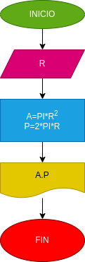

# ejercicio no. 1

##calcular el area y el perimetro del radio R.

variable de entrada (imput)

R:radio  del circulo 

variable del proceso y salida [pocessimd, strang, outout]

A: area del circulo 
p: perimetro del circulo

# DISEÑO

# CONSTRUCCION

## Este archivo esta esrito en Markdown

